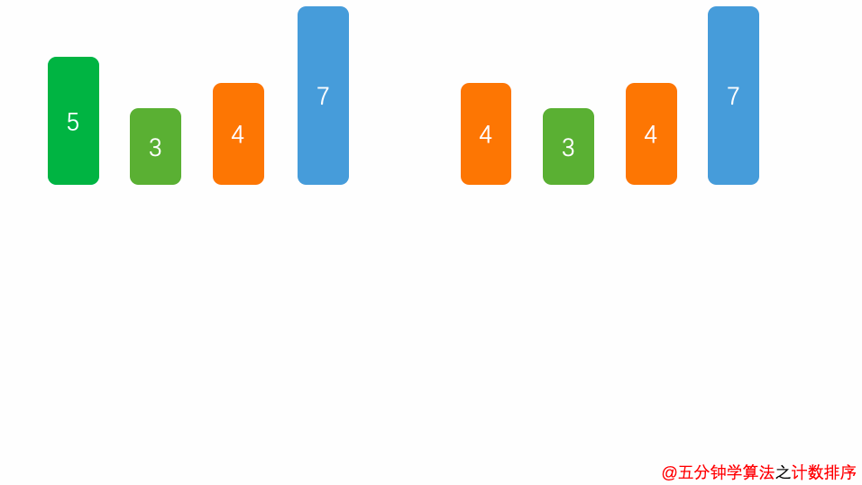
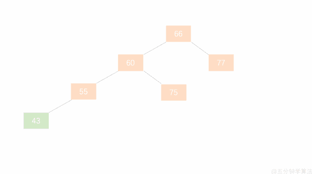
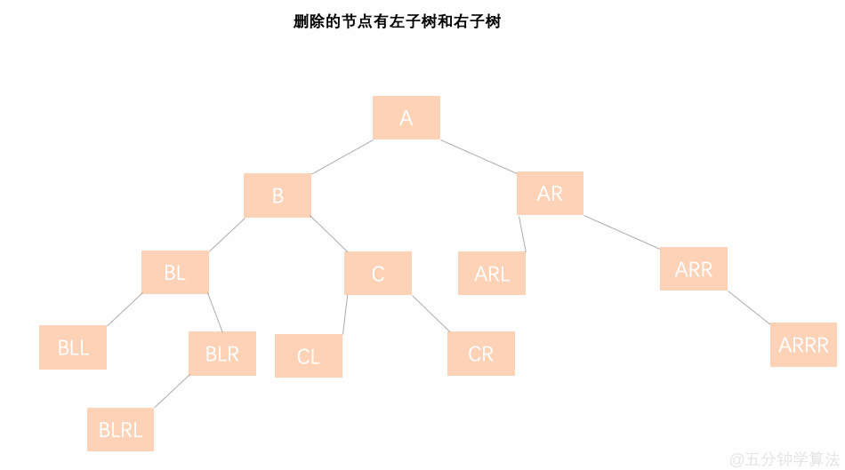

# 数据结构

---

## 二叉树

- 使用指针实现
1. #### 满二叉树
   
   - 每一个非叶节点都有两个子节点
   
   - 叶节点数**等于**其分支节点数加**一**
   
   - 空子树的的数量**等于**其节点数加一
   
   - 哈夫曼编码树是满二叉树

2. #### 完全二叉树
   
   - 堆数据结构是完全二叉树
   
   - ##### 使用数组实现完全二叉树
     
     - Parent(r) = (r - 1) / 2 ---向下取整
     
     - LeftChild = 2r + 1
     
     - RightChild = 2r + 2

3. #### 遍历
   
   - 前序遍历，中左右，根节点在序列第一位
   
   - 中序遍历，左中右，
   
   - 后序遍历，左右中，根节点在序列最后一位
   
   ```
   void preorder(BinNode* root)
   {
       if(root == NULL)return;
       visit(root);
       preorder(root -> left);
       preorder(root -> right);
   }
   
   void preorder2(BinNode* root)
   {
       visit(root);
       if(root -> left) preorder(root -> left);
       if(root -> right) preorder(root -> right);
   }
   ```
   
   - preorder比preorder2要好
     
     * 虽然2比1少调用函数一半的次数，但2要访问左右子树两次
     
     * 安全性，2无法判断根节点一开始就为空的情况

# 

4. #### 二叉搜索树
   
   - 该结点的值都小于或***等于***的右子树中任意一个结点的值
   
   - 删除一个值后，可使用右子树的最小值填补
     
     - 若使用左子树的最大值替换，可能会出现左子树的值与替换值相等的情况，破坏二叉搜索树的性质

5. #### 堆
   
   - 完全二叉树
   
   - 使用**数组**实现（~~再被问到怎么取堆的最后一个值，还不会答~~）
   
   - 插入一个值的时间代价：log(n)，最远调整距离为树的高度
   
   - siftdown：从倒数第二层进行siftdown，直到到达根节点（每一个结点需要递归向下判断结点值是否大于子节点的值，来确定是否需要siftdown）

6. #### Haffman编码树
   
   - 取最小权值的两个进行建子树
   
   - Huffman编码的最简形式在文件压缩技术中并不常用
   
   - 逆过程根据每一位的值是“0”或“1”确定选择左分支还是右分支——直到到达一个叶结点

### 

## 树

森林定义为一棵或更多棵树的集合

1. #### 表示方法
   
   - 一：提供最左结点和右兄弟结点的指针，也可以使用改进的节点表，第一列为左兄弟节点索引，第二列为值，第三列为父索引值，第四列为右兄弟结点索引值
   
   - 二：提供父结点指针，通常用于判断两个结点是否在同一棵树中（看根结点是否相同），难以寻找结点的兄弟结点
   
   - 三：子结点表，表中第一列为结点的值，第二列为父结点的索引值，接下来为保存有子结点索引值的链表
   
   - 四：动态表示法

2. 只有空指针NULL才被当做叶结点，止痒的节点表提供足够的信息来恢复树结构。

### 

## 内排序

- ##### 冒泡排序
  - **定义**
    
    - 两轮循环，比较相邻的两个的元素大小，相当于把最大(小)挤到一边
    
    

###### 

- ##### 选择排序
  
  - 定义
    
    - 找到数组中最小的元素，拎出来，将它和数组的第一个元素交换位置
    
    
    
    ###### 

- ##### 插入排序
  
  - 定义
    
    - 两个循环，将待排序的元素逐个插入到已排序的子序列中
    
    

###### 

- ##### Shell排序

- ##### 归并排序
  
  - 分成n个块，不断两个两个归并块
  
  - 使用辅助数组进行归并的话，空间复杂度为`O(n)`
  
  - 也可以不使用，进行原地的归并交换
  
  
  
  - 关键代码：
  
  ```cpp
  void sort(int[] arr，int[] tempArr，int startIndex，int endIndex)
  {
  
          if(endIndex <= startIndex)return;
  
          //中部下标
          int middleIndex = startIndex +(endIndex - startIndex)/2;
  
          //分解
          sort(arr，tempArr，startIndex，middleIndex);
          sort(arr，tempArr，middleIndex + 1，endIndex);
  
          //归并
          merge(arr，tempArr，startIndex，middleIndex，endIndex);
      }
  ```
  
  ###### 

- ##### 快速排序
  
  - 快速排序的核心思想也是分治法，分而治之。它的实现方式是每次从序列中选出一个基准值，其他数依次和基准值做比较，比基准值大的放右边，比基准值小的放左边，然后再对左边和右边的两组数分别选出一个基准值，进行同样的比较移动，重复步骤，直到最后都变成单个元素，整个数组就成了有序的序列。
  
  
  
  - 关键代码：
  
  ```cpp
  void sort(int[] arr， int startIndex， int endIndex) {
  
      if (endIndex <= startIndex) return;
  
      //切分            返回左右指针相遇的点
  
      int pivotIndex = partitionV2(arr， startIndex， endIndex);
      sort(arr， startIndex， pivotIndex-1);
      sort(arr， pivotIndex+1， endIndex);
  
  }
  ```

###### 

- ##### 堆排序
  
  - 插入元素建堆，插一次调整一次堆
  
  - 建完堆后pop出元素就是排好序的
  
  
  
  - 关键代码：
  
  ```cpp
  public static void sort(int[] arr) {
      int length = arr.length;
      //构建堆
      buildHeap(arr， length);
      for ( int i = length - 1; i > 0; i-- ) {
          //将堆顶元素与末位元素调换
          int temp = arr[0];
          arr[0] = arr[i];
          arr[i] = temp;
          //数组长度-1 隐藏堆尾元素
          length--;
          //将堆顶元素下沉 目的是将最大的元素浮到堆顶来
          sink(arr， 0， length);
      }
  }
  private static void buildHeap(int[] arr， int length) {
      for (int i = length / 2; i >= 0; i--) {
          sink(arr， i， length);
      }
  }
  
  /**
   * 下沉调整
   * @param arr 数组
   * @param index 调整位置
   * @param length 数组范围
   */
  private static void sink(int[] arr， int index， int length) {
      int leftChild = 2 * index + 1;//左子节点下标
      int rightChild = 2 * index + 2;//右子节点下标
      int present = index;//要调整的节点下标
  
      //下沉左边
      if (leftChild < length && arr[leftChild] > arr[present]) {
          present = leftChild;
      }
  
      //下沉右边
      if (rightChild < length && arr[rightChild] > arr[present]) {
          present = rightChild;
      }
  
      //如果下标不相等 证明调换过了
      if (present != index) {
          //交换值
          int temp = arr[index];
          arr[index] = arr[present];
          arr[present] = temp;
  
          //继续下沉
          sink(arr， present， length);
      }
  }
  ```
  
  ###### 

- ##### 计数排序
  
  - 先遍历寻找到待排序序列的最大值来创建数组
  
  - 使用数组记录元素出现的次数
  
  - 使用元素的值作为数组的下标来计数
  
  - 时间复杂度为$O(n+m)$，空间复杂度为$O(max)$
  
  - 我要排的数据里有 0 呢？ int[] 初始化内容全是 0 ，排毛线(可以使用偏移量，先将数字加上偏移量，避免与初始值重复)
  
  
  
  ###### 

- ##### 基数排序
  
  - 基数排序是一种非比较型整数排序算法，其原理是将数据按位数切割成不同的数字，然后按每个位数分别比较。
  
  - 假设说，我们要对 100 万个手机号码进行排序
  
  - 建议从个位开始排序，从低位到高位，好操作
    
    - 先按对应的位放入对应的桶（桶内有进入顺序），按从大到小拿出
  
  
  
  ###### 

- 不稳定算法：**快些选队**——快排，Shell，选择，堆

|         | 最坏                        | 最好         | 一般         | 稳定                                              |
|:-------:|:-------------------------:|:----------:|:----------:|:-----------------------------------------------:|
| 插入排序    | 数据是逆序，每一次插入到第一位，后面都要移位    | $n$        | $n^2$      | 是                                               |
| 冒泡排序    | 无                         | $n^2$      | $n^2$      | 是                                               |
| 选择排序    | 无                         | $n^2$      | $n^2$      | `(7) 2 4 [7] 1`排序时候,`(7)`和1调换,`(7)`就到了`[7]`的后面了 |
| Shell排序 |                           |            |            |                                                 |
| 快速排序    | 选择的轴值一直是序列中的最大或最小值（$n^2$） | $nlogn$    | $nlogn$    | 轴值交换导致不稳定                                       |
| 归并排序    | 辅助数组都一样，原地的话逆序交换次数最多      | $nlogn$    | $nlogn$    | 是                                               |
| 堆排序     | 没什么坏情况吧                   | $nlogn$    | $nlogn$    | 建堆或者是调整堆的时候可能会导致不稳定                             |
| 计数排序    | 区间大，空间大；                  | $O(n+m)$   | $O(n+m)$   | 稳不稳定难说啊                                         |
| 分配排序    |                           |            |            | 是                                               |
| 基数排序    | 无                         | $maxBit*n$ | $maxBit*n$ | 是                                               |

#### 

### 外排序

1. #### 置换选择排序
   - **任务为创建较长的初始顺串**
     
     - 假设主存大小为M条记录，则平均情况下可以创建长度为2M条记录的顺串
   
   - **实现**
     
     - 读入数据，放入数组，设置LAST = M-3
     
     - 建立最小堆
     
     - 从输入缓冲区中读入数据，若小于根节点，输出到输出缓冲区
     
     - 若大于根节点，堆pop出根节点
     
     - 重复上述步骤，直至堆没了
   
   - **最好，坏，平均情况**
     
     - 最好：顺序输入，顺串可以为整个数据
     
     - 最坏：逆序输入，顺串为堆的大小
     
     - 平均：2M条记录
   
   #####
2. #### 多路归并排序
   - **实现**
     
     - 把K个顺串分块
     
     - 把K个顺串的第一块同时读入主存
     
     - 进行K路归并
     
     - 当一个块已经归并完成，读入该顺串的下一个块

#### 

3. #### 外部排序总结
   - 建立尽可能大的初始顺串
   
   - 在所有阶段尽可能使输入、处理和输出并行
   
   - 使用尽可能多的工作主存
   
   - 使用尽可能多的磁盘，并行I/O

#### 

### 检索

1. #### 自组织线性表
   
   - 按使用频率排序
     
     ###### 

2. #### 散列
   
   - **删除散列的关键码可能会导致散列表部分失效**
     
     - 删除后留下墓碑标记，来记录当前槽被使用过
     
     - 再删除时进行一次局部重组，继续探查下去，交换记录到当前槽
     
     - 定期重新散列整个表
   
   - ##### 冲突解决
     
     - **单链方法**，有冲突就把数据存在对应槽的链表上
     
     - **桶式散列**，散列表的槽是一个桶，可以存放多个数据，溢出的数据放在专门的溢出桶中
     
     - **线性探查**，如果冲突就根据探查函数（函数线性）寻找下一个空槽
     
     - **二次探查**，探查函数为二次，避免数据的基本聚集

### 

### 索引

- 数据库索引技术详见[数据库知识点](数据库知识点.md)
1. #### 线性索引
   
   - 包含一个关键码字段和一个定长指针（指向数据的相应记录）
   
   - 多级线性索引
     
     ###### 

2. #### 2-3 树
   
   - **定义**
     
     - 一个节点有一个或两个关键码
     
     - 一个内部节点拥有两个或三个子结点
     
     - 总是平衡，因为所有叶结点在同一层
   
   - **实现**
     
     - 使用指针，左中右指针
   
   - **插入**
     
     - 如果叶结点只有一个值，直接插入
     
     - 两个值，拆分为两个结点，提升中间值到父结点
     
     - 父结点也满了，拆分，一人两个子结点，提升中间值到父结点的父结点
   
   ##### 

3. #### B-tree

4. #### $B^+$-tree

5. #### AVL-tree
   
   - **定义**（平衡二叉树）
     
     - **数据结构节点保存有`树的高度，父节点，左右子树节点`**
     
     - 可以是空树。
     
     . 假如不是空树，任何一个节点的左子树与右子树都是平衡二叉树，并且高度之差的绝对值不超过 1。
   
   - **特性**
     
     - 保持树的左右两端保持平衡，树的查找效率最高。
   
   - **平衡因子**
     
     - 平衡因子的值可以取`0，1，-1`，对应计算为`左子树的高度-右子树的高度`
   
   - **最小失衡子树**
     
     - 在新插入的节点向上查找，以第一个平衡因子的**绝对值**超过 1 的节点为根的子树称为最小不平衡子树。
     
     - 一棵失衡的树，是有可能有多棵子树同时失衡的。而这个时候，我们只要调整最小的不平衡子树，就能够将不平衡的树调整为平衡的树。
   
   - **失衡与调整（插入版）**
     
     > 在所有的不平衡情况中，都是按照先 **寻找最小不平衡树**，然后 **寻找所属的不平衡类别**，再 **根据 4 种类别进行固定化程序的操作**。
     
     - 左左失衡（最高点在左子树的左子树中）
       
       - 使用右旋，将左子树提升为根节点，原左子树的右子树附加到原根节点的左子树
       
       
     
     - 右右失衡（最高点在右子树的右子树中）
       
       - 使用左旋，将右子树提升为根节点，将原右子树的左子树附加到原根节点的右子树
       
       
     
     - 左右失衡（最深点在左子树的右子树上）
       
       - 先使用左旋再使用右旋
     
     - 右左失衡（最深点在右子树的左子树上）
       
       - 先使用右旋再使用左旋
   
   - **失衡与调整（删除版）**
     
     - 删除叶节点
       
       - 删除，接下来从父节点往上寻找最小失衡树，调整
       
       - 
     
     - 删除节点只有左子树或右子树
       
       - 删除，将自身的左子树或右子树附加到父节点中，从父节点开始向上寻找最小失衡树，调整
       
       - 
     
     - 删除的节点同时有左子树和右子树
       
       - 删除，并且寻找删除节点的**前继节点（左子树的最右一个节点）**或**后继节点（右子树的最左一个节点）**来填补当前位置，从**替换节点**（前继或后继节点）的父节点（图中的BL）开始向上寻找最小失衡树，调整
       
       - 
   
   ##### 

6. #### RB-tree
   
   - 

#### 

### 图

1. #### 表示方法
   
   - **相邻矩阵**
     
     - 第`i`行表示以`Vi`为起点的边
     
     - 若存在`Vi`到`Vj`的边，则在`（i,j）`处做标记
   
   - **邻接表**
     
     - 以链表为元素的数组
     
     - 数组中存有每个顶点的链表
     
     - 每个顶点的链表储存该顶点邻接的顶点
   
   ##### 

2. #### 图的遍历
   
   - **深度优先搜索**
     
     - 标记自身顶点为VISITED
     
     - 打印并在下一个顶点调用DFS
     
     - **利用递归的思想，将处理的子顶点进栈，VISIT，直到顶点没有相邻点，函数返回，出栈，以达到深度搜索**
     
     ```cpp
     void DFS(Graph* G, int v)
     {
         G->setMark(v,VISITED);    //设置标记
         //do something
         //first返回顶点v的第一个相邻顶点，若无返回v的相邻顶点数
         for(int w = G->first(v); w<G->n(); w=G->next(v,w))
             if(G->getMark(w) == UNVISITED)
                 DFS(G,w);
     }
     ```
   
   - **广度优先搜索**
     
     - 利用队列和循环实现
     
     - 循环中将相邻顶点入队
     
     ```cpp
     void BFS(Graph* G, int start, Queue<int>* Q)
     {
         int v, w;
         Q->enqueue(start);            //将开始顶点入队
         G->setMark(start, VISITED);   //设置标记
         while(Q->length() != 0)
         {
             v = Q->dequeue();
             //do something
             for(int w = G->first(v); w<G->n(); w=G->next(v,w))
                 if(G->getMark(w) == UNVISITED)
                 {
                     //将相邻顶点标记并入队   
                     G->setMark(w, VISITED);
                     Q->enqueue(w);
                 }
         }
     }
     ```

3. #### 最短路径
   
   - ##### Dijkstra算法
     - 

4. #### 最小支撑树
   
   - ##### Prim算法（按顶点处理）
     - 选择任意一个顶点N开始，加入队列MST
     
     - 在N相邻的边中选择最小权重的一条，并把该边连接的顶点M加入队列MST
     
     - 不断在MST中选择连接未在MST中顶点的最小权重的边
     
     - 直至全部顶点加入MST
   
   ##### 
   
   - ##### Kruskal算法（按边处理）
     - 将顶点集合分为V个等价类，每个等价类包含一个顶点
     
     - 如果一条边连接两个等价类，则连接这两个等价类
       
       - 需要利用最小堆来对边的权重排序
       
       - 从最小的边开始处理
